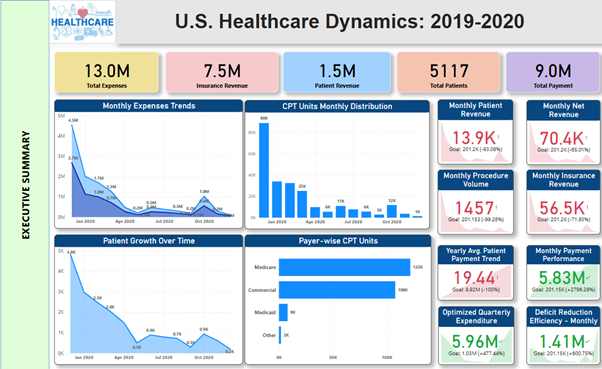
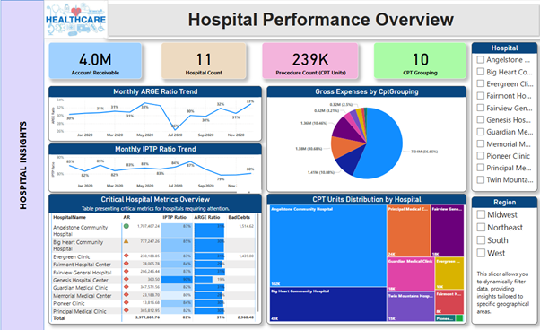
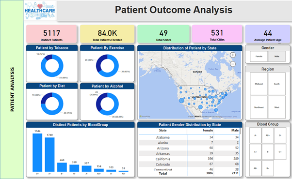
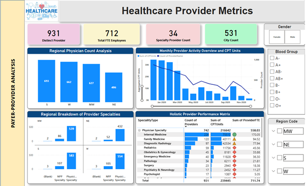
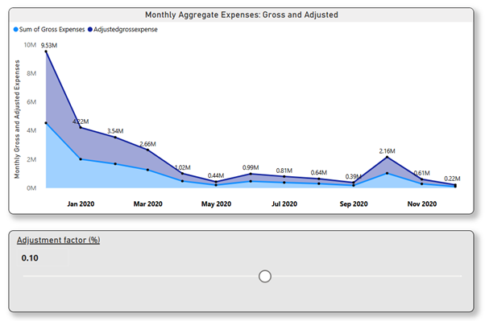

# U.S. Healthcare Dynamics: A Comprehensive Study 

Welcome to this thoughtfully developed U.S. Healthcare Analytics Dashboard—an immersive journey into the nation’s healthcare system across the years 2019 and 2020. This project aims to offer a detailed examination of critical components shaping healthcare in the United States. Structured like a narrative, each section of the dashboard uncovers unique insights, providing a deeper understanding of this complex and evolving industry. Let's embark on this exploration into the core of healthcare, where each section contributes to a richer appreciation of the system’s transformation over time.

## Executive Summary
Start with a concise overview of the most influential trends and performance indicators that impacted the U.S. healthcare sector between 2019 and 2020. This summary highlights the essential takeaways from the broader analysis presented in the dashboard.

## Hospital Analysis
Engage with a comprehensive evaluation of hospitals and healthcare facilities, focusing on operational performance, patient outcomes, and institutional efficiency. This section uncovers trends and insights that can inform strategic improvements in hospital management and service delivery.

## Patient Analysis
Analyze patient-related data to reveal patterns in demographics, treatment outcomes, and overall care experience. This portion of the dashboard brings forward the human side of healthcare, shedding light on how services impact patients directly.

## Payer-Provider Analysis
Investigate the financial and operational relationships between healthcare payers and providers. This section examines reimbursement models, monetary exchanges, and potential areas of collaboration for a more integrated healthcare ecosystem.

## Monthly Expenses Overview
Gain a detailed view of monthly expenditures throughout different healthcare segments. This analysis highlights opportunities to improve cost efficiency and optimize resource allocation across the system.

# Project Objective
The primary goal of this project, titled "U.S. Healthcare Dynamics", is to equip healthcare stakeholders with actionable insights. By identifying key trends and underlying patterns, this analysis supports professionals, decision-makers, and policymakers in making data-informed choices that enhance the quality and efficiency of healthcare services across the nation.
